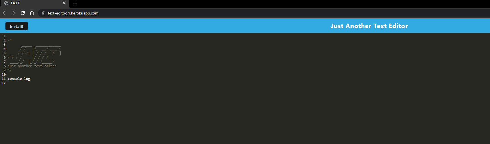
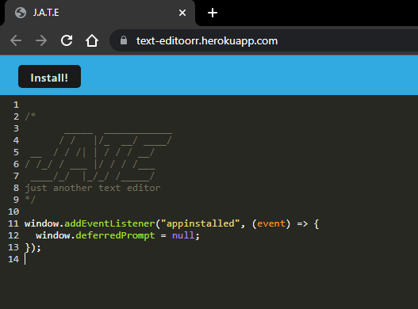

# <Text-Editor>

## Description

This application is able to let you give direct input, save it even when offline andhard refreshed and also allows you to install. It was built with the intention of correctly using PWA to save/install the web, allow offline access, and correctly use the PWA database. It solves the problem of coders needing somewhere to log important info, code snippets and more when out and abut of have a spur of the moment thought. Since its so easy to download onto your phone this can solve that issue! I learned about the difference of versions between databases and about new errors ive never experienced before (for example codemirror) which required some looking into.

## Table of Contents (Optional)

- [Installation](#installation)
- [Usage](#usage)
- [Credits](#credits)
- [License](#license)

## Installation

If you wish to take your application off the web, simply launch and click the install button at the top left!

## Usage

Open the application,

site: https://text-editoorr.herokuapp.com/

Type in the terminal:

click enter and reload to see the text stays.

Or Download the application with the install button!

## Credits

github: https://github.com/hannahhue/text-editor

hannahhue: https://github.com/hannahhue

## License

MIT License

Permission is hereby granted, free of charge, to any person obtaining a copy of this software and associated documentation files (the "Software"), to deal in the Software without restriction, including without limitation the rights to use, copy, modify, merge, publish, distribute, sublicense, and/or sell copies of the Software, and to permit persons to whom the Software is furnished to do so, subject to the following conditions:

The above copyright notice and this permission notice shall be included in all copies or substantial portions of the Software.

THE SOFTWARE IS PROVIDED "AS IS", WITHOUT WARRANTY OF ANY KIND, EXPRESS OR IMPLIED, INCLUDING BUT NOT LIMITED TO THE WARRANTIES OF MERCHANTABILITY, FITNESS FOR A PARTICULAR PURPOSE AND NONINFRINGEMENT. IN NO EVENT SHALL THE AUTHORS OR COPYRIGHT HOLDERS BE LIABLE FOR ANY CLAIM, DAMAGES OR OTHER LIABILITY, WHETHER IN AN ACTION OF CONTRACT, TORT OR OTHERWISE, ARISING FROM, OUT OF OR IN CONNECTION WITH THE SOFTWARE OR THE USE OR OTHER DEALINGS IN THE SOFTWARE.
